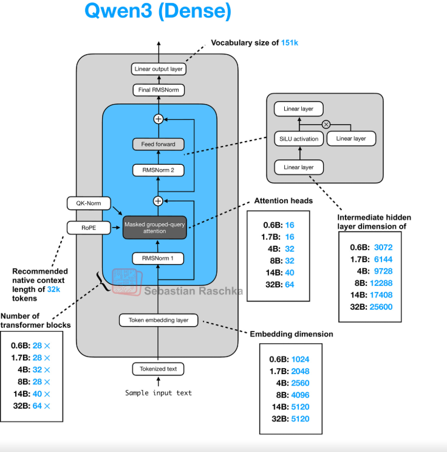

# Model Research time!

Since I'm basically copying Karpathy, I might as well start with nanocha.

At the top of his `gpt.py` file, he lists these features:

```
GPT model (rewrite, a lot simpler)
Notable features:
- rotary embeddings (and no positional embeddings)
- QK norm
- untied weights for token embedding and lm_head
- relu^2 activation in MLP
- norm after token embedding
- no learnable params in rmsnorm
- no bias in linear layers
- Group-Query Attention (GQA) support for more efficient inference
```

I'll go into each one of these components in detail later

He also mentions that the "nanochat" model he trains in the $100 run has:

```
1280 channels  
10 heads  
head_dim = 128  
~560M parameters
```

That's the picture he presents. So at first glance, nanochat looks like a neat ~560M-parameter architecture with some modern design decisions. Before committing to copying it, though, I wanted to compare it to other models in the same ballpark.

Here's a quick table of models I can reasonably yoink inspiration from:

| Model                       | Params | Layers | d_model | Attn heads (Q / KV) | Head dim | FFN dim    | MLP nonlinearity |
| --------------------------- | ------ | ------ | ------- | ------------------- | -------- | ---------- | ---------------- |
| **nanochat (claimed) 560M** | ~0.56B | 20     | 1280    | 10 / 10             | 128      | 5120       | ReLU²            |
| **Gemma 3 1B**              | ~1B    | 26     | 1152    | 8 / 2 (GQA)         | 144      | ~6.9–13.8k | GeGLU-ish        |
| **Qwen3 0.6B**              | ~0.6B  | 28     | 1024    | 16 / 8 (GQA)        | 128      | 3072       | SwiGLU-ish       |
| **SmolLM2 360M**            | ~0.36B | 24     | 1024    | 16 / GQA            | 64       | 4096       | GELU             |
| **Llama 3.2 1B**            | ~1.23B | 16     | 2048    | 32 / 8 (GQA)        | 64       | 8192       | SwiGLU           |

Just from this, nanochat already stands out as unusual:

1. **ReLU²** instead of a SwiGLU-like variant. That's not common in modern small models, so it feels very intentional. I definitely want to test this in an ablation.
2. **d_model = head_dim * num_heads** exactly, whereas most models pick a clean d_model first and derive head_dim from it.
3. **GQA is mentioned but not actually *used* by default**, whereas every modern small model uses it.

At this point I thought: "Okay, nanochat is quirky but ~560M params is a reasonable target."
But. Then I looked deeper.

# But if you actually check the training config…

If you dig into the scripts that correspond to Karpathy's *actual* long training runs (like `run1000.sh`), the architecture he trains is not the 560M-parameter one he describes in the simple overview.

Here's what the script config actually specifies:

```
vocab_size: 65536
num_layers: 32
model_dim: 2048
num_heads: 16
num_kv_heads: 16
...
# Number of parameters: 1,879,048,192
```

So the "real" nanochat used for the $1k run, and the one used for the impressive benchmark demos, is **1.88B parameters**, not 560M.

And now the puzzle pieces snap together:

* The earlier "560M" config is a *toy* version he presents to illustrate the architecture and is meant to be a speedrun for $100
* The actual training scripts use a much larger configuration.
* That means my earlier assumption about targeting ~560M for a Karpathy-style architecture was incorrect.
* And it means the stated attention dimensions don't map to the real budget I'm going for.

So, to keep the research consistent, I need to treat nanochat as a **1.8B-ish model**, not a 560M model, when comparing it to other small LLMs.

Given this correction, nanochat's true trained size (1.88B) feels a bit large. It's doable, but it's less compute-efficient and makes ablations way slower. I want to iterate aggressively on architecture decisions, and that favors models in the ~300M–700M range.

So I pivoted to looking more closely at models that actually live in that range and are trained with modern design choices.

---

## Token budgets and why this matters

Karpathy's runs, for context:

* **$100 run** → 560M params → 11.2B tokens
* **$1k run** → 1.8B params → 37.6B tokens
* **$2.5k run** → 2.2B params → 88.7B tokens

Now compare that with modern small-model token counts:

* **Llama 3.2 1B** → ~9T tokens (distilled)
* **Gemma 3 1B** → 2T tokens (distilled)
* **Qwen2 1.5B** → 7T tokens
* **Qwen2.5 1.5B** → 18T tokens
* **SmolLM2** → ~11T tokens
* **Qwen3 600M** → 36T tokens (!!)

This makes something very clear:
Modern models train on token counts that are *orders of magnitude* larger than Karpathy's compute-optimal estimates. Nanochat is not meant to chase SOTA, it's meant to be instructive.

So extrapolating from the cost of Karpathy's runs, with my own budget, I can realistically train a ~600M model on ~100B tokens. 

So the sweet spot for me is around **600M parameters**.

---

# Choosing a base architecture

With the corrected nanochat parameter count and realistic training budgets in mind, I narrowed my starting point to two models:

* **SmolLM2 360M**
* **Qwen3 600M**

Reasons:

1. Both have public checkpoints, so I can validate my forward pass.
2. Both are very open about their architectural choices.
3. They're modern and competitive.
4. There are great PyTorch guides for both.
5. And honestly: I want to explore *why big labs do what they do*, not just follow Karpathy line-by-line.

---

| Field                           | **Qwen3 600M**   | **SmolLM2 360M**                          |
| ------------------------------- | ---------------- | ----------------------------------------- |
| **Model Type**                  | Qwen3ForCausalLM | LlamaForCausalLM                          |
| **hidden_size (d_model)**       | 1024             | 960                                       |
| **head_dim**                    | 128              | — (derives from hidden_size / heads ≈ 64) |
| **num_attention_heads**         | 16               | 15                                        |
| **num_key_value_heads**         | 8                | 5                                         |
| **num_hidden_layers**           | 28               | 32                                        |
| **intermediate_size (FFN dim)** | 3072             | 2560                                      |
| **MLP activation**              | SiLU             | SiLU                                      |
| **attention_bias**              | false            | false                                     |
| **attention_dropout**           | 0.0              | 0.0                                       |
| **rms_norm_eps**                | 1e-6             | 1e-5                                      |
| **max_position_embeddings**     | 40,960           | 8,192                                     |
| **rope_theta**                  | 1,000,000        | 100,000                                   |
| **vocab_size**                  | 151,936          | 49,152                                    |

---

# Verdict

I'm starting with **Qwen3 600M**.

Why:

* It's the current leader in the "small-but-capable" category.
* I have clean, trustworthy reference code via the *LLMs from Scratch* repo.
* It fits my target parameter range perfectly.
* It's architecturally modern, especially around attention and activation choices.
* I'll understand more by building something aligned with current SOTA practices.

One thing I'll need to adjust is **rope_theta**, since Qwen3 is designed for massive context windows that I don't need. But that's simple.

---

# Implementation progress

I've already implemented the model from scratch in raw PyTorch. It's mostly careful copy/paste, but a model is a model. I also implemented a basic forward pass from the reference code, so correctness is solid.



I took this image from Sebastian Raschka, he does LLM analysis and he is also where I got my starting code for the model from. Like I said at the start, I assume you have basic knowledge of LLMs and understand the various parts, at least up to Karpathy's videos.

With this out of the way, you can se its a fairly standard Dense decoder only transformer.

I personally hate it when people show the math of something but don't show the code near it. Especially when it comes to ML because the code is what actually matters. so I am not going to continue the cycle of violence. 

Lets go through each of Karpathy's notable transformer changes, in code AND math!
```
Notable features:
- rotary embeddings (and no positional embeddings)
- QK norm
- untied weights for token embedding and lm_head
- relu^2 activation in MLP
- norm after token embedding
- no learnable params in rmsnorm
- no bias in linear layers
- Group-Query Attention (GQA) support for more efficient 
```

## rotary embeddings (and no positional embeddings)

So in this funny comment we have two things here. First, there's **positional embeddings**. Karpathy actually implemented this from scratch in his famous transformer video.

There's not much heavy math behind standard positional embeddings. All you really need to know is that the model takes the position index of a token (0, 1, 2...), translates it into an embedding vector, and then just **adds** that to the token embedding.

### So here's the math. BEHOLD:

$$h_i = x_i + P_i$$

And here's the code:

```python
import torch
import torch.nn as nn

class NaivePositionalEmbedding(nn.Module):
    def __init__(self, max_length, d_model):
        super().__init__()
        # Learned table of shape [max_length, d_model]
        self.pos_emb = nn.Embedding(max_length, d_model)

    def forward(self, x):
        """
        x: tensor of shape [batch, seq_len, d_model] 
        """
        batch_size, seq_len, d_model = x.size()

        # positions = [0, 1, 2, ..., seq_len-1]
        positions = torch.arange(seq_len, device=x.device)

        # lookup positional embeddings
        pos_vectors = self.pos_emb(positions)        # [seq_len, d_model]

        # broadcast and add to token embeddings
        return x + pos_vectors.unsqueeze(0)          # [batch, seq_len, d_model]
```

### RoPE (Rotary Positional Embeddings)
Now let's talk about **RoPE**, the new kid on the block.

Traditional positional embeddings just slap a static vector onto the token (Additive). RoPE is different. Instead of adding, it **multiplies**. It bakes the position directly into the attention mechanism by rotating the vectors in space.

The intuition is simple: If I want to know the distance between Minute 15 and Minute 30 on a clock, I don't need to know exactly where the hand is; I just need to know the **angle** between them. RoPE allows the model to understand the **relative** distance between tokens using this rotation logic.

### So here's the math. BEHOLD AGAIN:

For a single 2D pair of values from your embedding, the rotation at position $m$ by angle $\theta$ looks like this:

$$
\begin{pmatrix}
\cos(m\theta) & -\sin(m\theta) \\
\sin(m\theta) & \cos(m\theta)
\end{pmatrix}
\begin{pmatrix}
x_1 \\
x_2
\end{pmatrix}
$$

This is pure 2D rotation. Attention later does a dot product between different tokens. When two vectors are both rotated, the rotation cancels out in the dot product and the final value only depends on the difference in positions $(m - n)$. That is the key insight. The model learns relative distance, not absolute position.

Ok, so my embedding is not 2 numbers? it might be 64 or 4096 etc, what gives? RoPE groups them into adjacent pairs:

* $(x_0, x_1)$ is one pair
* $(x_2, x_3)$ is another pair
* $(x_4, x_5)$ is another pair
* etc

Each pair rotates at its own frequency. The lower dimension pairs rotate faster, capturing local information. The higher dimension pairs rotate slower, capturing long-range information.

The code computes a unique frequency for each pair $j$:

$$
\text{inv\_freq}[j] = 10000^{-2j/d}
$$

where $j$ counts the channel pairs and $d$ is the total head dimension.

Using that frequency, the rotation angle for position $m$ and pair $j$ is:

$$
\theta_{m,j} = m \cdot \text{inv\_freq}[j]
$$

Our code precomputes

* positions $m$
* all frequencies `inv_freq[j]`
* the angle table $\theta$ used for every head dimension and every position
* then $\cos(\theta)$ and $\sin(\theta)$

That is exactly what `compute_rope_params` returns.

I took the code from LLMs from scratch rope embeddings and then I split it up so it's not so pythonic with the original comment above it. (some minor changes when there was weird stuff)

### CODE FOR COMPUTING
```Python

def compute_rope_params(head_dim, theta_base=10_000, context_length=4096, dtype=torch.float32):
    """
    Compute cosine and sine tables used for Rotary Positional Embeddings (RoPE).

    Intuition.
    - RoPE treats every pair of channels in the head dimension as a 2D vector.
    - Each pair gets its own rotation frequency. lower indices rotate slowly. higher indices rotate faster.
    - Positions are encoded as rotation angles that grow with the position index.
    - We precompute cos(angle) and sin(angle) for all positions and all frequencies once.
    """

    # Sanity check. RoPE assumes we can group the head dimension into pairs
    assert head_dim % 2 == 0, "Embedding dimension must be even"

    # ============================================================
    # Original line.
    #inv_freq = 1.0 / (theta_base ** (torch.arange(0, head_dim, 2, dtype=dtype).float() / head_dim))
    # ============================================================
    # 1.1. Create indices for the dimension pairs. [0, 2, 4, ..., head_dim - 2]
    pair_indices = torch.arange(0, head_dim, 2, dtype=dtype)

    # 1.2. Convert indices to float so we can safely divide
    pair_indices = pair_indices.float()

    # 1.3. Compute the exponent that controls how fast each pair rotates
    #    Lower indices get smaller exponents, so they change more slowly
    exponent = pair_indices / head_dim

    # 1.4. Raise theta_base to that exponent
    theta_powers = theta_base ** exponent

    # 1.5. Take the inverse to get the actual frequencies used by RoPE
    inv_freq = 1.0 / theta_powers

    # ============================================================
    # Original line.
    # positions = torch.arange(context_length, dtype=dtype)
    # ============================================================

    # UNCHANGED
    positions = torch.arange(context_length,dtype=dtype)

    # ============================================================
    # Original line.
    # angles = positions.unsqueeze(1) * inv_freq.unsqueeze(0)  # Shape: (context_length, head_dim // 2)
    # ============================================================

    # 3.1 Make positions a column vector. shape becomes [context_length, 1]
    positions_column = positions.unsqueeze(1)

    # 3.2 Make inv_freq a row vector. shape becomes [1, half_dim]
    inv_freq_row = inv_freq.unsqueeze(0)

    # 3.3 Multiply them to get all angles
    #     angles[pos, i] = positions[pos] * inv_freq[i]
    angles_half = positions_column * inv_freq_row

    # ============================================================
    # Original line.
    # angles = torch.cat([angles, angles], dim=1)  # Shape: (context_length, head_dim)
    # ============================================================

    # 4.1 Duplicate each angle so it applies to both channels of the pair
    angles = torch.cat([angles_half, angles_half],dim=1)

    # ============================================================
    # Original lines.
    # cos = torch.cos(angles)
    # sin = torch.sin(angles)
    # ============================================================

    # 5.1 Precompute cosine of all angles
    cos = torch.cos(angles)

    # 5.2 Precompute sine of all angles
    sin = torch.sin(angles)

    # Shapes of both cos and sin.
    # [context_length, head_dim]
    # These will later be reshaped and broadcast to match (batch, heads, seq_len, head_dim)
    return cos, sin
```
---

### Applying the rotation

Take one embedding vector $x$ for one token. Split into first and second halves:

$$
(x_1, x_2) = \text{the pair we rotate}
$$

The rotation is:

$$
x_1' = x_1 \cos\theta - x_2 \sin\theta
$$

$$
x_2' = x_2 \cos\theta + x_1 \sin\theta
$$

Multiply original by cos. Multiply the rotated half by sin. Add them together. That is exactly the two equations above applied to every pair independently.

#### The Code
We don't actually build giant matrixes (that's slow). We use a trick to apply the rotation element-wise.

```python
def apply_rope(x, cos, sin):
    """
    Apply Rotary Positional Embedding to tensor x using precomputed cos and sin.

    Parameters.
    - x   shape (batch_size, num_heads, seq_len, head_dim)
    - cos shape (context_length, head_dim)
    - sin shape (context_length, head_dim)

    Intuition.
    - Treat each pair of channels in x as a 2D vector (x1, x2).
    - For each position, rotate that vector by an angle determined by cos and sin.
    - Rotation is done in such a way that attention remains well behaved and can extrapolate.
    """

    # Extract basic shape facts
    batch_size, num_heads, seq_len, head_dim = x.shape

    # RoPE requires an even head dimension so we can form channel pairs
    assert head_dim % 2 == 0, "Head dimension must be even"

    # ============================================================
    # Original lines.
    # x1 = x[..., : head_dim // 2]  # First half
    # x2 = x[..., head_dim // 2 :]  # Second half
    # ============================================================

    # 1.1 Calculate half_dim explicitly
    half_dim = head_dim // 2

    # 1.2 Take the first half of the channels along the last dimension
    x_first_half = x[..., :half_dim]   # Shape. (batch_size, num_heads, seq_len, half_dim)

    # 1.3 Take the second half of the channels
    x_second_half = x[..., half_dim:]  # Shape. (batch_size, num_heads, seq_len, half_dim)


    # ============================================================
    # Original lines.
    # cos = cos[:seq_len, :].unsqueeze(0).unsqueeze(0)  # Shape: (1, 1, seq_len, head_dim)
    # sin = sin[:seq_len, :].unsqueeze(0).unsqueeze(0)
    # ============================================================

    # 2.1 Select only the cos values for the sequence length we actually use
    cos_for_seq = cos[:seq_len, :]   # Shape. (seq_len, head_dim)

    # 2.2 Add a dimension for batch. shape becomes (1, seq_len, head_dim)
    cos_for_seq = cos_for_seq.unsqueeze(0)

    # 2.3 Add a dimension for heads. shape becomes (1, 1, seq_len, head_dim)
    cos_for_seq = cos_for_seq.unsqueeze(0)

    # 2.4 Do the same for sin
    sin_for_seq = sin[:seq_len, :]   # Shape. (seq_len, head_dim)
    sin_for_seq = sin_for_seq.unsqueeze(0)  # (1, seq_len, head_dim)
    sin_for_seq = sin_for_seq.unsqueeze(0)  # (1, 1, seq_len, head_dim)

    # 2.5 For clarity keep original names
    cos_broadcast = cos_for_seq
    sin_broadcast = sin_for_seq
    # Shapes now match and can broadcast over (batch_size, num_heads, seq_len, head_dim)


    # ============================================================
    # Original line.
    # rotated = torch.cat((-x2, x1), dim=-1)
    # ============================================================

    # 3.1 Negate the second half of channels
    neg_second_half = -x_second_half

    # 3.2 Concatenate (-x2, x1) along the last dimension to build the 90 degree rotated version
    #     This corresponds to rotating the 2D vector (x1, x2) by 90 degrees
    rotated = torch.cat([neg_second_half, x_first_half], dim=-1)


    # ============================================================
    # Original line.
    # x_rotated = (x * cos) + (rotated * sin)
    # ============================================================

    # 4.1 Multiply original x by cos. this scales the original components
    x_times_cos = x * cos_broadcast

    # 4.2 Multiply the rotated component by sin
    rotated_times_sin = rotated * sin_broadcast

    # 4.3 Add them to get the final rotated representation
    x_rotated = x_times_cos + rotated_times_sin


    # ============================================================
    # Original line.
    # return x_rotated.to(dtype=x.dtype)
    # ============================================================

    # 5.1 Cast back to the original dtype of x
    #     This lets you precompute cos and sin in higher precision if you want
    x_rotated = x_rotated.to(dtype=x.dtype)

    return x_rotated
```

## QK norm

This is one of those changes that sounds trivial but saves your life when models get huge.

In standard Transformers, as the model gets deeper, the magnitude of the embedding vectors tends to drift and grow. When you perform the dot product between Query ($Q$) and Key ($K$), those large magnitudes multiply, resulting in massive values.

When you feed massive values into a Softmax, the gradients vanish (it saturates), and the model stops learning. Or worse, the attention collapses to a single token (entropy collapse).

**QK Norm** fixes this by simply normalizing the Queries and Keys *before* they crash into each other in the dot product. It's like putting a speed limiter on the vectors so the attention mechanism doesn't explode.

### So here's the math. BEHOLD:

Standard attention looks like this:

$$ \text{Attention}(Q, K, V) = \text{softmax}\left(\frac{QK^T}{\sqrt{d_k}}\right)V $$

With **QK Norm**, we introduce two normalization functions (usually LayerNorm or RMSNorm) applied specifically to Q and K:

$$ \hat{Q} = \text{Norm}(Q) $$
$$ \hat{K} = \text{Norm}(K) $$

$$ \text{Attention}(\hat{Q}, \hat{K}, V) = \text{softmax}\left(\frac{\hat{Q}\hat{K}^T}{\sqrt{d_k}}\right)V $$

This ensures that no matter how deep the network is, the inputs to the attention mechanism have a consistent variance.

### The Code

BEHOLD

```python
# Reshape

# Optional normalization
if self.q_norm:
    queries = self.q_norm(queries)
if self.k_norm:
    keys = self.k_norm(keys)
```

## untied weights for token embedding and lm_head

In older models (GPT-2), the matrix used to turn words into vectors (Input) was the exact same matrix used to turn vectors back into words (Output).

In newer models (Karpathy's code), we "untie" them. We use two different matrices. The idea is that reading a token and predicting a token are effectively different jobs requiring different parameters.

### 1. The Original Way: Tied Weights
One master matrix $W$ of shape $[Vocab, Dim]$.
*   **Input:** Pick a row.
*   **Output:** Transpose $W$ to $[Dim, Vocab]$ and multiply.

### So here's the math:

$$ \text{Input: } x = W[\text{index}] $$
$$ \text{Output: } \text{logits} = h \cdot W^T $$

And here's the code. Note the `.t()` transpose at the end:

```python
import torch
import torch.nn as nn

class TiedGPT(nn.Module):
    def __init__(self, vocab_size, d_model):
        super().__init__()
        # One Master Matrix for both Input and Output
        self.w_emb = nn.Embedding(vocab_size, d_model)

    def forward(self, idx):
        # 1. Input: Lookup (Standard embedding)
        h = self.w_emb(idx) # Shape: [B, T, D]

        # ... Transformer Layers processing h ...

        # 2. Output: Reuse the SAME matrix, but transposed
        #    h: [B, T, D] @ w_emb.T: [D, V] -> [B, T, V]
        logits = torch.matmul(h, self.w_emb.weight.t())
        
        return logits
```

### 2. The new way: Untied Weights
Two separate matrices. $W_{in}$ for input, $W_{out}$ for output. This lets the model be more expressive or something (I think people just tried this and it works better)

### So here's the math:

$$ \text{Input: } x = W_{in}[\text{index}] $$
$$ \text{Output: } \text{logits} = h \cdot W_{out} $$

And here's the code. Notice we define two separate layers:

```python
class UntiedGPT(nn.Module):
    def __init__(self, vocab_size, d_model):
        super().__init__()
        # 1. Input Matrix
        self.tok_embeddings = nn.Embedding(vocab_size, d_model)
        
        # 2. Output Matrix (Completely separate parameters)
        self.output = nn.Linear(d_model, vocab_size, bias=False)

    def forward(self, idx):
        # 1. Input: Use W_in
        h = self.tok_embeddings(idx)

        # ... Transformer Layers processing h ...

        # 2. Output: Use W_out (Standard Linear layer)
        logits = self.output(h)
        
        return logits
```

## relu^2 activation in MLP

Karpathy uses **Squared ReLU**. It is computationally cheaper than GELU (no exponentials).

Qwen (and Llama) uses **SwiGLU**. It uses **three** matrices instead of two. It splits the signal into a "Gate" and a "Value". The Gate controls what information passes through.

### 1. Karpathy's Way (ReLU²)

Karpathy uses squared ReLU. It uses two linear layers. One Up-Projection and one Down-Projection. The activation happens after the Up-Projection

$$ z = x \cdot W_{fc}^T $$
$$ h = \max(0, z)^2 $$
$$ \text{out} = h \cdot W_{proj}^T $$

And the code:

```python
class MLP(nn.Module):
    def __init__(self, config):
        super().__init__()
        self.c_fc = nn.Linear(config.n_embd, 4 * config.n_embd, bias=False)
        self.c_proj = nn.Linear(4 * config.n_embd, config.n_embd, bias=False)

    def forward(self, x):
        x = self.c_fc(x)
        x = F.relu(x).square()
        x = self.c_proj(x)
        return x
```

---

### 2. Qwen's Way (SwiGLU)

Qwen uses a gated mechanism. It learns a "switch" (Gate) and "content" (Value) separately.

### So here's the math. BEHOLD AGAIN:

$$ \text{Gate} = \text{SiLU}(x \cdot W_{fc1}) $$
$$ \text{Value} = x \cdot W_{fc2} $$
$$ \text{out} = (\text{Gate} \odot \text{Value}) \cdot W_{fc3} $$

And the code:

```python
class FeedForward(nn.Module):
    def __init__(self, cfg):
        super().__init__()
        self.fc1 = nn.Linear(cfg["emb_dim"], cfg["hidden_dim"], dtype=cfg["dtype"], bias=False)
        self.fc2 = nn.Linear(cfg["emb_dim"], cfg["hidden_dim"], dtype=cfg["dtype"], bias=False)
        self.fc3 = nn.Linear(cfg["hidden_dim"], cfg["emb_dim"], dtype=cfg["dtype"], bias=False)

    def forward(self, x):
        x_fc1 = self.fc1(x)
        x_fc2 = self.fc2(x)
        x = nn.functional.silu(x_fc1) * x_fc2
        return self.fc3(x)
```

## no bias in linear layers

You might notice `bias=False` all over the code snippets.

### So here's the math:

Old (Standard):
$$ y = xW + b $$

New (Karpathy/Llama):
$$ y = xW $$

### The Code
It's just one flag.

```python
# The 'bias=False'
self.c_fc = nn.Linear(config.n_embd, 4 * config.n_embd, bias=False)
```

Upon first glance, it seems pretty clear cut. BUT THATS WHERE YOU"RE WRONG. While its super simple to implement and 

Biases are redundant when combined with layernorm that have 
Layer Normalization centers activations around zero before most linear projections. That makes per-neuron bias terms mostly pointless. Any constant shift they would provide gets erased by normalization. So architects drop them. This reduces parameters and speeds up training. Accuracy stays unchanged.

## norm after token embedding
## no learnable params in rmsnorm
## Group-Query Attention (GQA) support for more efficient inference


Next steps:

1. **Split the codebase** into model, inference, and tokenizer modules. I'm training my own tokenizer, so HF's is going out the window.
2. **Document everything**, module by module. I mostly understand the architecture, but I want diagrams for ROPE and RMSNorm.
3. **Optimize the hell out of it**:

   * `torch.compile` for free wins
   * Flash Attention (easy speedup)
   * Attention/matmul optimizations that modern models use

After that comes tokenizer training, dataset prep, and then ablations.

